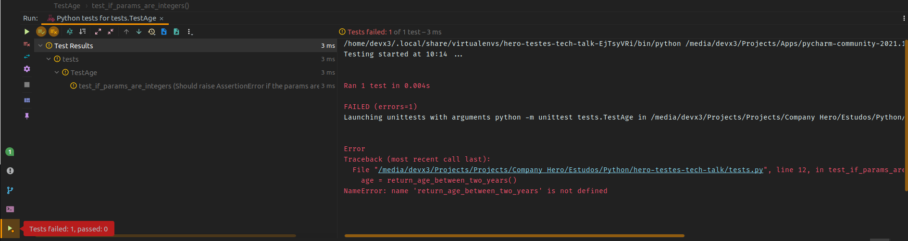
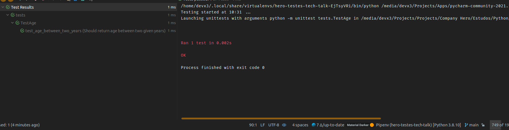
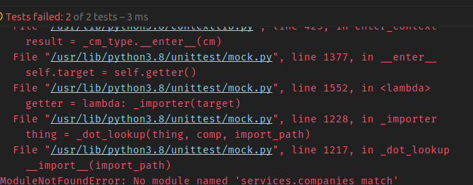
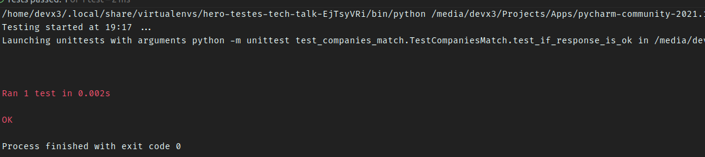
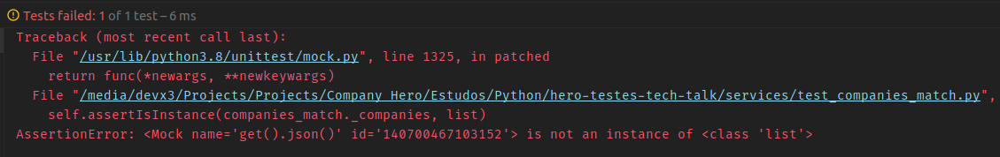
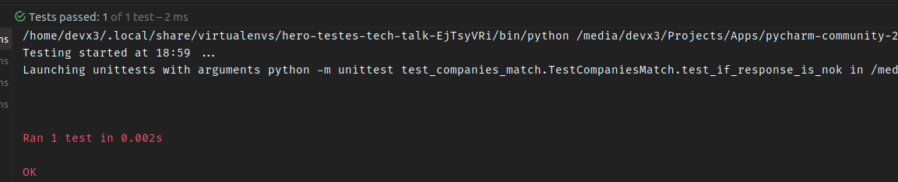
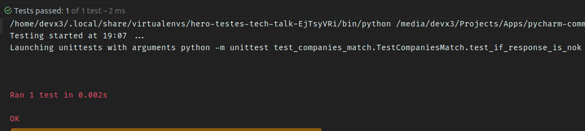
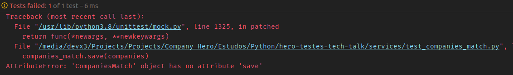

# Hero Tech Talk - Testes e TDD

Todo o conteúdo passado no tech talk vai estar nesse documento.

## TDD
O objetivo geral é trazer uma visão sobre o TDD e como podemos trazer isso para a nossa rotina de desenvolvimento.

### O que é TDD?
TDD vem de *Test Driven Development* ou, traduzido em terra tupiniquim como Desenvolvimento Orientado a Testes. A ideia do
TDD é trabalhar em ciclos, que acontecem na seguinte ordem: 

- Primeiro escrevemos um teste que deve falhar. Nessa etapa o código ainda não foi nem implementado;
- Depois, criamos o código que vai fazer o nosso teste passar;
- Feito isso, refatoramos o código para melhorar alguns pontos como deixá-lo legível. É necessário testar novamente e garantir que o novo código continue passando no teste.

E definitivamente o TDD não é uma forma de escrever testes, e sim, uma metodologia de desenvolvimento e escrita de códigos.


### Ciclo do TDD


- **Red:** escreva um pequeno teste automatizado que, ao ser executado, irá falhar;
- **Green:** implemente um código que seja suficiente para ser aprovado no teste recém-escrito;
- **Refactor:** refatore o código, a fim dele ser melhorado, deixando-o mais funcional e mais limpo.

Esse ciclo é chamado de **red-green-refactor** ou **red-green-blue**.

### Por que utilizar TDD?

- Código mais objetivo: desenvolvemos com um objetivo em mente
- Diminui a ocorrência de erros: O risco do código gerar um erro diminui
- Refatoração: Auxilia na refatoração e manutenção do código
- Tempo: Gasta o tempo necessário para desenvolver a feature
- Cumpre os requisitos: Atende especificamente as histórias do usuário
- Melhoria incremental: Cada teste aprovado é uma pequena vitória

### Quando utilizar TDD?
A ideia é que você utilize o TDD em testes unitários - testes que vão avaliar o comportamento de funções, classes e métodos em específico.

### Como os mocks se aplicam na nossa área

"PUTA MADRE, COMO EU VOU FAZER ESSE CARAJO?"

Essa frase soa familiar para você? Pois é, ela sempre vem na minha cabeça antes de começar a criar uma nova funcionalidade. 

A questão é que com o TDD, partimos do pressuposto que **você já sabe** qual o resultado que espera obter daquele trecho específico de código. Logo, isso nos força a parar, pensar e somente depois disso, começar a desenvolver uma solução.   

# Exemplo 1

Eu quero uma funcionalidade que descobre qual é a idade de uma pessoa em um determinado ano informado. Para isso, vamos precisar de duas informações.

- A primeira é o ano de nascimento da pessoa
- A segunda é o ano em que a pessoa quer saber a sua idade

Essa função precisa nos retornar a idade da pessoa.

Simples né?

### Começando pelos testes
```python
import unittest


class TestAge(unittest.TestCase):

    def test_age_between_two_years(self):
        """Should return age between two given years"""
        
        expected_age = 22
        received_age = return_age_between_two_years(1993, 2015)

        self.assertEqual(received_age, expected_age)
```

E como esperado, ao rodar o teste, nos gerou o seguinte erro:


Isso porque nós nem se quer criamos a função `return_age_between_two_years` (Red)

### Criando a função
```python
def return_age_between_two_years(birth_year: int, year_to_compare: int) -> int:
    age = year_to_compare - birth_year
    return age
```

Agora escrevemos o mínimo para o nosso teste passar. 

### Rodando o teste mais uma vez:


E o nosso teste continua passando. 🖤

## EXEMPLO 2

Quase todo mundo sabe que eu estou criando uma feature de atualização cadastral das empresas. Esse sistema tem um serviço de terceiro integrado, que é a galera da D-Legal (Domingo Legal).

Eu preciso enviar previamente uma lista de empresas desatualizadas para que o sistema deles faça uma scraping das informações cadastrais de cada empresa.

**O que vamos testar:**
- Testa se a request deu ok e deve retornar uma lista de requests
- Testar o comportamento caso falhe a requisição (deve retornar uma lista)
- Testa se as infos são salvas no Banco de Dados

### Testando comportamento caso a Request seja um sucesso
```python
from unittest import mock, TestCase
from unittest.mock import Mock

from services.companies_match import CompaniesMatch
from services.mock import RESPONSE_MOCK


class TestCompaniesMatch(TestCase):
    @mock.patch('services.companies_match.requests.get')
    def test_if_response_is_ok(self, mock_get):
        """Return json with response"""

        mock_get.return_value = Mock(ok=True)
        mock_get.return_value.json.return_value = RESPONSE_MOCK
        companies_match = CompaniesMatch()
        companies_match.get()
        self.assertIsInstance(companies_match._companies, list)
        self.assertEqual(companies_match._companies[0]['request_id'], 'REQUEST_UUID')
```

Queremos verificar que, caso o `ok` da response seja `True`, a lista retornada contém o primeiro item com a key `request_id` contendo `REQUEST_UUID`. 


Óbvio, nós ainda não temos o arquivo `companies_match` que deve conter classe responsável por fazer a requisição. Vamos criá-lo!

### Classe CompaniesMatch()

```python
import requests
from typing import List, Union

class CompaniesMatch:

    _companies: Union[List, None] = None

    def __init__(self):
        self._companies = None

    def get(self) -> None:
        """Return companies"""
        response = requests.get('http://url.example')
        self._companies = response.json()
```

### Executando o teste novamente


Agora sim!

### Refatorando o código
```python
import requests
from typing import List, Union


class CompaniesMatch:

    _companies: Union[List, None] = None
    _baseurl: str = 'http://url.example'

    def __init__(self):
        self._companies = None

    def get(self) -> None:
        """Return companies"""
        response = self._request()
        self._companies = response.json()

    def _request(self) -> requests.Response:
        return requests.get(self._baseurl)
```

### E o nosso teste...


...continua passando! 

Ótimo, nós fechamos mais um ciclo. Agora vamos para o próximo teste. 

### Teste caso a response seja falso
```python
from unittest import mock, TestCase
from unittest.mock import Mock

from services.companies_match import CompaniesMatch
from services.mock import RESPONSE_MOCK


class TestCompaniesMatch(TestCase):
    ...
    @mock.patch('services.companies_match.requests.get')
    def test_if_response_is_nok(self, mock_get):
        """Return empty list if response is not ok."""
        mock_get.return_value = Mock(ok=False)
        companies_match = CompaniesMatch()
        companies_match.get()
        self.assertIsInstance(companies_match._companies, list)
        self.assertEqual(companies_match._companies, [])
```

### Rodando o teste


### Fazendo ele passar
```python
...
class CompaniesMatch:
   ...
    def get(self) -> None:
        """Return companies"""
        response = self._request()
        if response.ok:
            self._companies = response.json()
        self._companies = []
    ...
```

E o teste? 



### Refatorando o Código
```python
...
class CompaniesMatch:
    ...
    def get(self) -> None:
        """Return companies"""
        response = self._request()
        self._companies = self._get_companies(response)

    @staticmethod
    def _get_companies(response: requests.Response) -> List[Dict[str, Any]]:
        data = []
        if response.ok:
            data = response.json()

        return data
    ...
```

TUDO OK!



### Testando se as informações são salvas no banco de dados

```python
@mock.patch('services.companies_match.requests.get')
def test_save_info_in_database(self, mock_get):
    """Save the returned data in database."""
    mock_get.return_value = Mock(ok=True)
    companies_match = CompaniesMatch()
    companies = companies_match.get()
    companies_match.save(companies)
```

### Executando o teste


## Fontes: 

https://www.treinaweb.com.br/blog/afinal-o-que-e-tdd
https://realpython.com/testing-third-party-apis-with-mocks/#refactoring-tests-to-use-classes